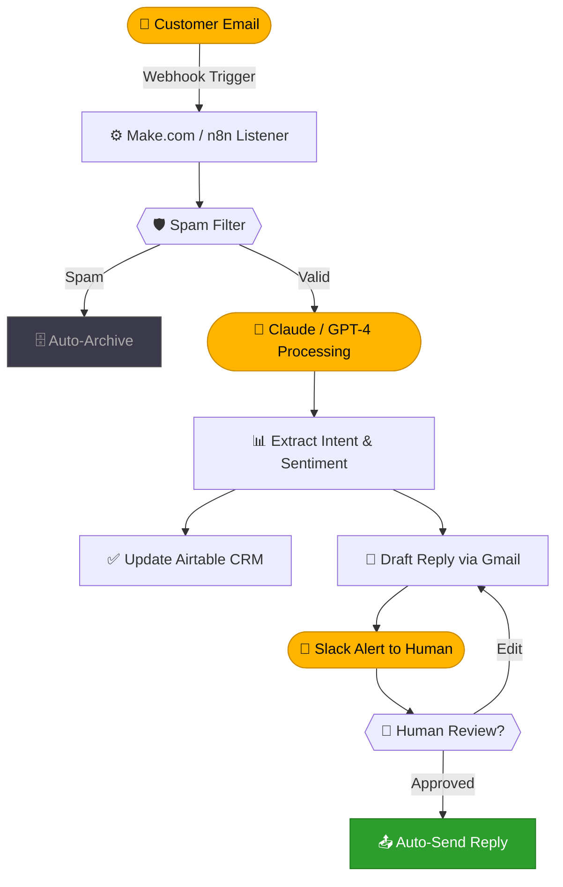

<div align="center">

<!-- ═══════════════════════════════════════════════════════ -->
<!--                      HERO HEADER                       -->
<!-- ═══════════════════════════════════════════════════════ -->


<br>

<a href="https://github.com/agniautomationz-lab">

</a>

<br><br>


&nbsp;

&nbsp;


<br><br>


</div>

---

<div align="center">
  <sub><i>"The first rule of any technology used in a business is that automation applied to an efficient operation will magnify the efficiency."</i></sub>
  <br><sub><b>— Bill Gates</b></sub>
</div>

---

## `> whoami`

```yaml
name     : Agni Automationz Lab
role     : AI Automation Engineers
location : Colombo, LK  🇱🇰
mission  : Democratize intelligent automation for every business
focus    :
  - AI Agents & RAG Pipelines
  - No-Code Workflow Automation (Make.com, n8n, Zapier)
  - LLM Integration & Prompt Engineering
  - Business Process Optimization
hiring   : true   # open to collaborations
status   : Always Building ⚡
```

---

## `> about --lab`

<table>
<tr>
<td width="50%" valign="top">

**🤖 AI Agents & Chatbots**
We build fully autonomous agents that think, decide, and act — powered by GPT-4 and Claude, connected to your live data via RAG pipelines.

</td>
<td width="50%" valign="top">

**⚙️ Workflow Automation**
End-to-end business automation using Make.com, n8n, and Zapier. We connect every tool in your stack and let them talk to each other.

</td>
</tr>
<tr>
<td width="50%" valign="top">

**🔓 No-Code First Philosophy**
Great automation doesn't need thousands of lines of code. We leverage Flowise, LangFlow, and Bubble to ship fast, ship smart.

</td>
<td width="50%" valign="top">

**🌐 Open Collaboration**
All our experiments, templates, and guides live here. Fork, adapt, and build. Automation should be accessible to everyone.

</td>
</tr>
</table>

---

## `> philosophy --verbose`

> Human bandwidth is too valuable to spend on repetitive, mundane tasks. We follow a strict 3-step paradigm:

<table>
<tr>
<td align="center" width="33%">

**`01 · ANALYZE`**

Deconstruct manual processes to expose the true data flow. Find exactly where time dies.

</td>
<td align="center" width="33%">

**`02 · AUTOMATE`**

Build robust API bridges with low-code engines. Make.com, n8n, Zapier as the connective tissue.

</td>
<td align="center" width="33%">

**`03 · AMPLIFY`**

Inject LLMs for cognitive decision-making, NLU, and dynamic, context-aware response generation.

</td>
</tr>
</table>

---

## `> services --list`

<table>
<tr>
<td width="33%">

**🧠 Custom AI Agents**
Autonomous multi-step agents wired to your tools, CRM, and knowledge base using RAG.

</td>
<td width="33%">

**💬 AI Chatbots**
Smart bots for support, sales, and onboarding — trained on your docs, live 24/7.

</td>
<td width="33%">

**🔄 Business Automation**
CRM updates, email workflows, reporting pipelines — automated from trigger to completion.

</td>
</tr>
<tr>
<td width="33%">

**📊 Data & Reporting**
AI-formatted weekly digests, automated dashboards, real-time Slack/Discord alerts.

</td>
<td width="33%">

**🎯 Lead Gen Workflows**
Scrape → LLM qualify → score → auto-draft personalized outreach. All in one flow.

</td>
<td width="33%">

**🔌 API Integration**
Connect any two tools that "don't talk." We build the bridge with webhooks and REST.

</td>
</tr>
</table>

---

## `> architecture --example`



---

## `> expertise --bars`

```
Make.com / n8n          ████████████████████  98%
Prompt Engineering      ███████████████████░  96%
OpenAI / Claude API     ███████████████████░  95%
Airtable / Notion       ██████████████████░░  92%
RAG Pipelines           ██████████████████░░  90%
Flowise / LangFlow      █████████████████░░░  88%
Zapier / Bubble         █████████████████░░░  85%
LangChain               ████████████████░░░░  80%
```

---

## `> builds --status`

| # | Project | Description | Stack | Status |
|---|---------|-------------|-------|--------|
| 🤖 | **SupportBot RAG v2** | Autonomous support agent with live knowledge sync, escalation routing, and CSAT scoring | n8n + Claude | `🟡 IN PROGRESS` |
| 🎯 | **LeadFlow Engine** | Scrape → LLM qualify → score → auto-draft personalized outreach | Make.com + GPT-4 | `🟡 IN PROGRESS` |
| 📊 | **InsightPulse Reports** | DB-to-Slack AI digest with weekly formatted summaries | Flowise + Airtable | `🔵 PLANNING` |
| 🔮 | **Multi-Agent Chain** | Research + draft + review agent orchestration pipeline | LangChain + Claude | `🔵 PLANNING` |

---

## `> projects --featured`

<table>
<tr>
<td width="33%" valign="top">

**🤖 SupportBot RAG**

`n8n` `Claude` `Pinecone`

Autonomous support agent synced to a live knowledge base. Handles 80% of tickets with zero human intervention.

⭐ 142 · `AI Agent`

</td>
<td width="33%" valign="top">

**🎯 LeadFlow Engine**

`Make.com` `GPT-4o` `Airtable`

End-to-end lead pipeline: scrape → qualify via LLM → score → auto-draft personalized outreach emails.

⭐ 98 · `Automation`

</td>
<td width="33%" valign="top">

**📊 InsightPulse**

`Flowise` `Airtable` `Slack`

Weekly AI digest engine — extracts insights from databases and pipes formatted reports to Slack.

⭐ 74 · `Reporting`

</td>
</tr>
</table>

---

## `> stack --ecosystem`

**⚙️ Automation Platforms**


**🧠 AI & LLM**


**🗃️ Data & Productivity**


---

## `> articles --latest`

| # | Title | Tag |
|---|-------|-----|
| 📄 | [Building a RAG Pipeline with Flowise in 10 Minutes](#) | `Tutorial` |
| 📄 | [Why n8n is Superior to Zapier for AI Integrations](#) | `Deep Dive` |
| 📄 | [Automating an Entire CRM with Make.com + OpenAI](#) | `Case Study` |
| 📄 | [Multi-Agent Orchestration Patterns for Production](#) | `Guide` |

---

## `> analytics`

<div align="center">


<br><br>


<br><br>

<a href="https://github.com/ryo-ma/github-profile-trophy">
  
</a>

<br><br>


</div>

---

## `> contribution --snake`

<div align="center">
  <picture>
    <source media="(prefers-color-scheme: dark)" srcset="https://raw.githubusercontent.com/agniautomationz-lab/agniautomationz-lab/output/github-contribution-grid-snake-dark.svg" />
    <source media="(prefers-color-scheme: light)" srcset="https://raw.githubusercontent.com/agniautomationz-lab/agniautomationz-lab/output/github-contribution-grid-snake.svg" />
    
  </picture>
</div>

> ⚙️ **To activate the snake animation**, add the [Platane/snk GitHub Action](https://github.com/Platane/snk) to your repo to auto-generate the SVG on every push.

---

## `> connect`

<div align="center">

<a href="https://linkedin.com/in/YOUR-LINKEDIN">
  
</a>
&nbsp;
<a href="https://twitter.com/YOUR-TWITTER">
  
</a>
&nbsp;
<a href="https://youtube.com/c/YOUR-CHANNEL">
  
</a>
&nbsp;
<a href="mailto:your@email.com">
  
</a>
&nbsp;
<a href="https://yourwebsite.com">
  
</a>
&nbsp;
<a href="https://www.buymeacoffee.com/YOUR-LINK">
  
</a>

</div>

---

<div align="center">
  
  <br>
  <sub><b>Agni Automationz Lab © 2026 · Working Smarter, Not Harder ⚡ · Colombo, LK 🇱🇰</b></sub>
</div>
