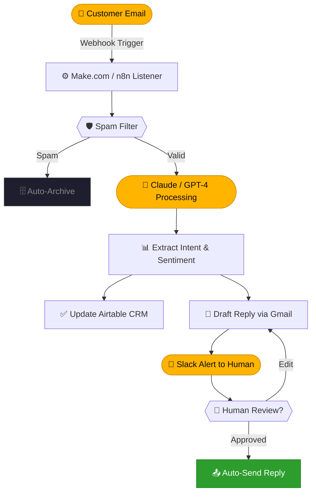

<div align="center">


<br>

[](https://github.com/agniautomationz-lab)

<br>

[](https://github.com/agniautomationz-lab)
[](https://github.com/agniautomationz-lab)
[](https://github.com/agniautomationz-lab)

<br>


</div>

<br>

<div align="center">
  <picture>
    <source media="(prefers-color-scheme: dark)" srcset="https://raw.githubusercontent.com/agniautomationz-lab/agniautomationz-lab/output/github-contribution-grid-snake-dark.svg" />
    <source media="(prefers-color-scheme: light)" srcset="https://raw.githubusercontent.com/agniautomationz-lab/agniautomationz-lab/output/github-contribution-grid-snake.svg" />
    
  </picture>
</div>

<br>

---

## `▸ whoami`

```yaml
╔══════════════════════════════════════════════════════════════╗
║  name     : Agni Automationz Lab                             ║
║  role     : AI Automation Engineers                          ║
║  location : Colombo, LK 🇱🇰                                  ║
║  mission  : Democratize intelligent automation for every     ║
║             business — from solopreneur to enterprise        ║
║  focus    :                                                  ║
║    ├─ AI Agents & RAG Pipelines                              ║
║    ├─ No-Code Workflow Automation (Make · n8n · Zapier)      ║
║    ├─ LLM Integration & Prompt Engineering                   ║
║    └─ Business Process Optimization                          ║
║  hiring   : true   # open to collaborations                  ║
║  status   : Always Building ⚡                               ║
╚══════════════════════════════════════════════════════════════╝
```

<br>

---

## `▸ about --lab`

<br>

<table>
<tr>
<td width="50%">

### 🤖 AI Agents & Chatbots
Fully autonomous agents that think, decide, and act — powered by **GPT-4** and **Claude**, connected to your live data via **RAG pipelines**. Built for zero-friction deployment into your existing stack.

</td>
<td width="50%">

### ⚙️ Workflow Automation
End-to-end business automation using **Make.com**, **n8n**, and **Zapier**. We connect every tool in your stack and let them work together without human intervention.

</td>
</tr>
<tr>
<td width="50%">

### 🔓 No-Code First Philosophy
Great automation doesn't need thousands of lines of code. We leverage **Flowise**, **LangFlow**, and **Bubble** to ship fast and ship smart — reducing time-to-deploy by 10×.

</td>
<td width="50%">

### 🌐 Open Collaboration
All our experiments, templates, and guides live here. Fork, adapt, and build. Automation should be **accessible to everyone** — not just engineering teams.

</td>
</tr>
</table>

<br>

---

## `▸ philosophy --verbose`

<br>

> *"Human bandwidth is too valuable to spend on repetitive, mundane tasks."*

<br>

<table>
<tr>
<td align="center" width="33%">

```
┌──────────────────┐
│   01 · ANALYZE   │
└──────────────────┘
```
Deconstruct manual processes to expose the true data flow. Find exactly **where time dies** — then eliminate it.

</td>
<td align="center" width="33%">

```
┌──────────────────┐
│  02 · AUTOMATE   │
└──────────────────┘
```
Build robust API bridges with low-code engines. **Make.com, n8n, Zapier** as the connective tissue of your operation.

</td>
<td align="center" width="33%">

```
┌──────────────────┐
│   03 · AMPLIFY   │
└──────────────────┘
```
Inject LLMs for cognitive decision-making, NLU, and dynamic **context-aware response generation** at scale.

</td>
</tr>
</table>

<br>

---

## `▸ services --list`

<br>

<table>
<tr>
<td width="33%">

### 🧠 Custom AI Agents
Autonomous multi-step agents wired to your tools, CRM, and knowledge base using **RAG**. Handles complex decision trees without human input.

</td>
<td width="33%">

### 💬 AI Chatbots
Smart bots for support, sales, and onboarding — trained on your docs, live **24/7**. Handles 80%+ of queries autonomously.

</td>
<td width="33%">

### 🔄 Business Automation
CRM updates, email workflows, reporting pipelines — automated **from trigger to completion** with full audit trails.

</td>
</tr>
<tr>
<td width="33%">

### 📊 Data & Reporting
AI-formatted weekly digests, automated dashboards, and real-time **Slack / Discord alerts** — delivered on schedule.

</td>
<td width="33%">

### 🎯 Lead Gen Workflows
Scrape → LLM qualify → score → auto-draft personalized outreach. **All in one flow**, end-to-end.

</td>
<td width="33%">

### 🔌 API Integration
Connect any two tools that "don't talk." We build the bridge with **webhooks and REST** — fast and reliably.

</td>
</tr>
</table>

<br>

---

## `▸ architecture --example`

<br>



<br>

---

## `▸ expertise --bars`

<br>

```
 Make.com / n8n          ████████████████████  98% ──── Automation Core
 Prompt Engineering      ███████████████████░  96% ──── LLM Mastery
 OpenAI / Claude API     ███████████████████░  95% ──── AI Integration
 Airtable / Notion       ██████████████████░░  92% ──── Data Layer
 RAG Pipelines           ██████████████████░░  90% ──── Knowledge Retrieval
 Flowise / LangFlow      █████████████████░░░  88% ──── Visual AI Builders
 Zapier / Bubble         █████████████████░░░  85% ──── No-Code Platforms
 LangChain               ████████████████░░░░  80% ──── Agent Orchestration
```

<br>

---

## `▸ builds --status`

<br>

| &nbsp; | Project | Description | Stack | Status |
|--------|---------|-------------|-------|--------|
| 🤖 | **SupportBot RAG v2** | Autonomous support agent with live knowledge sync, escalation routing & CSAT scoring | `n8n` + `Claude` |  |
| 🎯 | **LeadFlow Engine** | Scrape → LLM qualify → score → auto-draft personalized outreach in one flow | `Make.com` + `GPT-4` |  |
| 📊 | **InsightPulse Reports** | DB-to-Slack AI digest with weekly formatted summaries and trend detection | `Flowise` + `Airtable` |  |
| 🔮 | **Multi-Agent Chain** | Research + draft + review agent orchestration pipeline with human-in-loop | `LangChain` + `Claude` |  |

<br>

---

## `▸ projects --featured`

<br>

<table>
<tr>
<td width="33%" valign="top">

### 🤖 SupportBot RAG


Autonomous support agent synced to a live knowledge base. Handles **80% of tickets** with zero human intervention, with smart escalation for edge cases.

⭐ **142** &nbsp;·&nbsp; `AI Agent` &nbsp;·&nbsp; `RAG`

</td>
<td width="33%" valign="top">

### 🎯 LeadFlow Engine


End-to-end lead pipeline — scrape → qualify via LLM → score → auto-draft **personalized outreach emails** at scale. Zero manual steps.

⭐ **98** &nbsp;·&nbsp; `Automation` &nbsp;·&nbsp; `Lead Gen`

</td>
<td width="33%" valign="top">

### 📊 InsightPulse


Weekly AI digest engine — extracts insights from databases and pipes **formatted intelligence reports** directly to Slack. Actionable, not noisy.

⭐ **74** &nbsp;·&nbsp; `Reporting` &nbsp;·&nbsp; `Analytics`

</td>
</tr>
</table>

<br>

---

## `▸ stack --ecosystem`

<br>

**⚙️ Automation Platforms**


<br>

**🧠 AI & LLM**


<br>

**🗃️ Data & Productivity**


<br>

---

## `▸ analytics`

<br>

<div align="center">


<br><br>


<br><br>

<a href="https://github.com/ryo-ma/github-profile-trophy">
  
</a>

<br><br>


</div>

<br>

---

## `▸ articles --latest`

<br>

| &nbsp; | Title | Category |
|--------|-------|----------|
| 📄 | [Building a RAG Pipeline with Flowise in 10 Minutes](#) |  |
| 📄 | [Why n8n is Superior to Zapier for AI Integrations](#) |  |
| 📄 | [Automating an Entire CRM with Make.com + OpenAI](#) |  |
| 📄 | [Multi-Agent Orchestration Patterns for Production](#) |  |

<br>

---

## `▸ connect`

<br>

<div align="center">

[](https://linkedin.com/in/YOUR-LINKEDIN)
[](https://twitter.com/YOUR-TWITTER)
[](https://youtube.com/c/YOUR-CHANNEL)
[](mailto:your@email.com)
[](https://yourwebsite.com)
[](https://buymeacoffee.com/YOUR-LINK)

<br>

```
╔════════════════════════════════════════════════════════╗
║   Got a workflow to automate?  Let's talk.             ║
║   We turn chaos into systems — fast.                   ║
╚════════════════════════════════════════════════════════╝
```

</div>

<br>

---

<div align="center">
  <sub><i>"The first rule of any technology used in a business is that automation applied to an efficient operation will magnify the efficiency."</i></sub>
  <br><sub><b>— Bill Gates</b></sub>
</div>

<br>

<div align="center">
  
  <br>
  <sub><b>Agni Automationz © 2026 &nbsp;·&nbsp; Igniting the Future Of Automation ⚡ &nbsp;·&nbsp; Colombo, LK 🇱🇰</b></sub>
</div>
