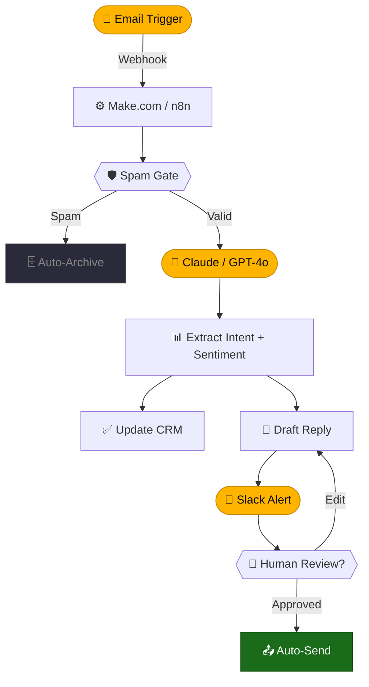

<div align="center">


<br>

<a href="https://github.com/agniautomationz-lab">
  
</a>

<br><br>


&nbsp;

&nbsp;


<br><br>


</div>

## $\textsf{\color{#FFB400} Who we are}$

```yaml
name             : Agni Automationz Lab
role             : AI Automation Engineers
location         : Colombo, LK  🇱🇰
founded          : 2024
tools_mastered   : 80+
llms_integrated  : 10   # GPT-4o, Claude, Gemini, Llama, Mistral, Cohere, Grok...
automation_platforms: ["Make.com", "n8n", "Zapier", "Activepieces", "Pipedream"]
ai_builders      : ["Flowise", "LangFlow", "Dify.ai", "Botpress", "Voiceflow"]
vector_dbs       : ["Pinecone", "Chroma", "Qdrant", "Weaviate", "PgVector"]
local_llm        : ["Ollama", "LM Studio", "AnythingLLM", "Open WebUI"]
mission          : "Democratize intelligent automation for every business"
status           : "Always Building ⚡"
```

## $\textsf{\color{#FFB400} Core philosophy}$

> Human bandwidth is too valuable to spend on repetitive, mundane tasks.

<table>
<tr>
<td align="center" width="33%">

**`01 · ANALYZE`**

Deconstruct every manual process to find the exact points where human time dies.

</td>
<td align="center" width="33%">

**`02 · AUTOMATE`**

Build bulletproof API bridges with low-code. Make.com and n8n as the nervous system.

</td>
<td align="center" width="33%">

**`03 · AMPLIFY`**

Inject LLMs for cognitive decisions, NLU, and dynamic generation at scale.

</td>
</tr>
</table>

## $\textsf{\color{#FFB400} What we build}$

<table>
<tr>
<td width="33%">

**🧠 Custom AI Agents**
Autonomous multi-step agents wired to your tools, CRM, and live knowledge base via RAG.

</td>
<td width="33%">

**💬 AI Chatbots**
Smart bots for support, sales, and onboarding — trained on your docs, live 24/7.

</td>
<td width="33%">

**🔄 Business Automation**
CRM, email, Slack, databases — automated from trigger to completion, end-to-end.

</td>
</tr>
<tr>
<td width="33%">

**📊 AI Reporting**
AI-formatted weekly digests, live dashboards, and Slack/Discord alerts on schedule.

</td>
<td width="33%">

**🎯 Lead Gen Engine**
Scrape → LLM qualify → score → auto-draft personalized outreach. One full flow.

</td>
<td width="33%">

**🔮 Multi-Agent Systems**
Orchestrate research, drafting, and review agents into one intelligent pipeline.

</td>
</tr>
<tr>
<td width="33%">

**📚 RAG Knowledge Bases**
Embed your docs, PDFs, and databases. LLMs answer from your data, not the internet.

</td>
<td width="33%">

**🔌 API Integration**
Connect any two tools that "don't talk." Webhooks, REST, and GraphQL bridges built fast.

</td>
<td width="33%">

**🛠️ Prompt Engineering**
Craft precise system prompts, chains, and evaluations for production LLM apps.

</td>
</tr>
</table>

## $\textsf{\color{#FFB400} Architecture pattern}$



## $\textsf{\color{#FFB400} AI tools arsenal}$

**🤖 Large Language Models**


**⚙️ Automation Platforms**


**🏗️ AI App Builders**


**🧬 Embedding & Vector Databases**


**🏃 Local LLM & Self-Hosted**


**🔗 AI Frameworks & Dev**


**🖥️ No-Code & Low-Code**


**🗃️ Data, CRM & Productivity**


## $\textsf{\color{#FFB400} Platform comparison}$

| Platform | LLM Native | No-Code | Self-Host | RAG Support | Our Rating |
|---|---|---|---|---|---|
| **Make.com** | ✅ Yes | ✅ Yes | ❌ No | ⚠️ Partial | ⭐⭐⭐⭐⭐ |
| **n8n** | ✅ Yes | ⚠️ Partial | ✅ Yes | ✅ Yes | ⭐⭐⭐⭐⭐ |
| **Flowise** | ✅ Yes | ✅ Yes | ✅ Yes | ✅ Yes | ⭐⭐⭐⭐⭐ |
| **Dify.ai** | ✅ Yes | ✅ Yes | ✅ Yes | ✅ Yes | ⭐⭐⭐⭐☆ |
| **Activepieces** | ✅ Yes | ✅ Yes | ✅ Yes | ❌ No | ⭐⭐⭐⭐☆ |
| **Zapier** | ⚠️ Partial | ✅ Yes | ❌ No | ❌ No | ⭐⭐⭐☆☆ |
| **LangFlow** | ✅ Yes | ✅ Yes | ✅ Yes | ✅ Yes | ⭐⭐⭐⭐☆ |
| **Botpress** | ✅ Yes | ✅ Yes | ✅ Yes | ⚠️ Partial | ⭐⭐⭐⭐☆ |

## $\textsf{\color{#FFB400} Expertise levels}$

```
Make.com / n8n                  ████████████████████  98%
Prompt Engineering              ███████████████████░  96%
GPT-4o / Claude API             ███████████████████░  95%
Flowise / LangFlow / Dify       ██████████████████░░  93%
Airtable / Notion / CRM         ██████████████████░░  92%
RAG Pipeline Design             ██████████████████░░  91%
Vector DB (Pinecone / Qdrant)   █████████████████░░░  88%
API Design / REST / Webhooks    █████████████████░░░  88%
LangChain / LlamaIndex          █████████████████░░░  85%
Zapier / Bubble / No-Code       █████████████████░░░  85%
CrewAI / Multi-Agent Systems    ████████████████░░░░  83%
Ollama / Local LLM Stack        ████████████████░░░░  82%
Supabase / PostgreSQL           ████████████████░░░░  80%
DSPy / AutoGen / Frameworks     ███████████████░░░░░  76%
```

## $\textsf{\color{#FFB400} Lab stats}$

<div align="center">


&nbsp;

&nbsp;

&nbsp;


</div>

## $\textsf{\color{#FFB400} Currently building}$

| # | Project | Description | Stack | Status |
|---|---------|-------------|-------|--------|
| 🤖 | **SupportBot RAG v2** | Live knowledge sync, escalation routing, CSAT scoring | n8n + Claude + Pinecone | `🟡 IN PROGRESS` |
| 🎯 | **LeadFlow Engine v2** | LLM scoring + auto-personalized outreach via Apollo.io | Make.com + GPT-4o | `🟡 IN PROGRESS` |
| 🔮 | **Multi-Agent Orchestrator** | CrewAI research → draft → review chain with human-in-loop | CrewAI + LangChain + Claude | `🟡 IN PROGRESS` |
| 📊 | **InsightPulse v2** | Multi-source AI digest with trend detection + anomaly alerts | Flowise + Dify + Slack | `🔵 PLANNING` |
| 🏠 | **Local AI Workspace** | Ollama + AnythingLLM + n8n for privacy-first automation | Ollama + Open WebUI + n8n | `🔵 PLANNING` |

## $\textsf{\color{#FFB400} Featured projects}$

<table>
<tr>
<td width="33%" valign="top">

**🤖 SupportBot RAG**

`n8n` `Claude` `Pinecone`

Autonomous support agent synced to a live knowledge base. Handles 80% of tickets with zero human intervention.

⭐ 142 · `AI Agent` · `RAG`

</td>
<td width="33%" valign="top">

**🎯 LeadFlow Engine**

`Make.com` `GPT-4o` `Apollo.io`

Scrape → LLM qualify → score → auto-draft personalized outreach. Full lead pipeline in one automated flow.

⭐ 98 · `Automation` · `LLM`

</td>
<td width="33%" valign="top">

**📊 InsightPulse**

`Flowise` `Airtable` `Slack`

Weekly AI digest engine — extracts insights from databases and pipes formatted reports to Slack on schedule.

⭐ 74 · `Reporting` · `AI`

</td>
</tr>
<tr>
<td width="33%" valign="top">

**🔮 ResearchBot**

`CrewAI` `Claude` `LangChain`

Multi-agent system that autonomously researches topics, drafts detailed reports, and emails polished summaries.

⭐ 61 · `Multi-Agent`

</td>
<td width="33%" valign="top">

**📚 DocuMind**

`Flowise` `Qdrant` `Ollama`

Drop PDFs into a folder. LLM answers questions from your entire document library — instantly, privately.

⭐ 55 · `RAG` · `Local AI`

</td>
<td width="33%" valign="top">

**🏠 PrivateStack**

`Ollama` `AnythingLLM` `n8n`

100% self-hosted AI workspace for zero data-leak automation. Your models, your server, your rules.

⭐ 48 · `Local LLM` · `Privacy`

</td>
</tr>
</table>

## $\textsf{\color{#FFB400} Latest publications}$

| # | Title | Category |
|---|-------|----------|
| 📄 | [Building a RAG Pipeline with Flowise in 10 Minutes](#) | `Tutorial` |
| 📄 | [Why n8n is Superior to Zapier for AI Integrations](#) | `Deep Dive` |
| 📄 | [Automating an Entire CRM with Make.com + OpenAI](#) | `Case Study` |
| 📄 | [Multi-Agent Orchestration with CrewAI in Production](#) | `Guide` |
| 📄 | [Dify vs Flowise vs LangFlow — Which AI Builder Wins?](#) | `Comparison` |
| 📄 | [Run Any LLM Locally for Free with Ollama + Open WebUI](#) | `Tutorial` |
| 📄 | [The Ultimate Prompt Engineering Cheatsheet for 2025](#) | `Reference` |
| 📄 | [Vector DB Showdown: Pinecone vs Qdrant vs Chroma](#) | `Comparison` |

## $\textsf{\color{#FFB400} What clients say}$

<table>
<tr>
<td width="50%" valign="top">

> *"Agni Automationz cut our lead response time from 3 days to 4 minutes. The LLM-powered qualification alone saved us 20 hours a week."*

**Sanjay R.** · Head of Sales, SaaS Co.

</td>
<td width="50%" valign="top">

> *"The RAG chatbot handles 80% of support tickets end-to-end. Our team now focuses on the 20% that actually needs a human touch."*

**Maya P.** · CTO, E-commerce Brand

</td>
</tr>
<tr>
<td width="50%" valign="top">

> *"Their automation architecture is the cleanest I've seen. Solid Make.com flows with intelligent LLM routing — no bloat, no fragile hacks."*

**Tom K.** · Founder, Digital Agency

</td>
<td width="50%" valign="top">

> *"InsightPulse transformed our board meetings. We now open with actual AI-generated data summaries instead of manually compiled slides."*

**Amara L.** · COO, Consulting Firm

</td>
</tr>
</table>

## $\textsf{\color{#FFB400} Analytics}$

<div align="center">


<br><br>


<br><br>

<a href="https://github.com/ryo-ma/github-profile-trophy">
  
</a>

<br><br>


</div>

## $\textsf{\color{#FFB400} Contribution snake}$

<div align="center">
  <picture>
    <source media="(prefers-color-scheme: dark)" srcset="https://raw.githubusercontent.com/agniautomationz-lab/agniautomationz-lab/output/github-contribution-grid-snake-dark.svg" />
    <source media="(prefers-color-scheme: light)" srcset="https://raw.githubusercontent.com/agniautomationz-lab/agniautomationz-lab/output/github-contribution-grid-snake.svg" />
    
  </picture>
</div>

> ⚙️ Activate via [Platane/snk GitHub Action](https://github.com/Platane/snk)

## $\textsf{\color{#FFB400} Let's connect}$

<div align="center">

<a href="https://linkedin.com/in/YOUR-LINKEDIN">
  
</a>
&nbsp;
<a href="https://twitter.com/YOUR-TWITTER">
  
</a>
&nbsp;
<a href="https://youtube.com/c/YOUR-CHANNEL">
  
</a>
&nbsp;
<a href="mailto:your@email.com">
  
</a>
&nbsp;
<a href="https://yourwebsite.com">
  
</a>
&nbsp;
<a href="https://www.buymeacoffee.com/YOUR-LINK">
  
</a>

</div>

<div align="center">
  <br>
  <sub><i>"The first rule of any technology used in a business is that automation applied to an efficient operation will magnify the efficiency."</i></sub>
  <br><sub><b>— Bill Gates</b></sub>
  <br><br>
  
  <br>
  <sub><b>Agni Automationz Lab © 2026 · Working Smarter, Not Harder ⚡ · Colombo, LK 🇱🇰</b></sub>
</div>
